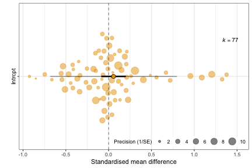
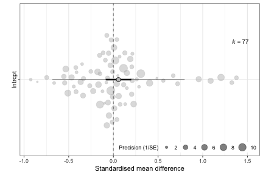
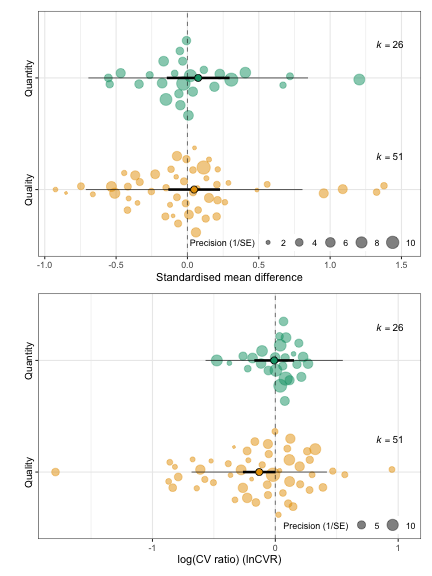
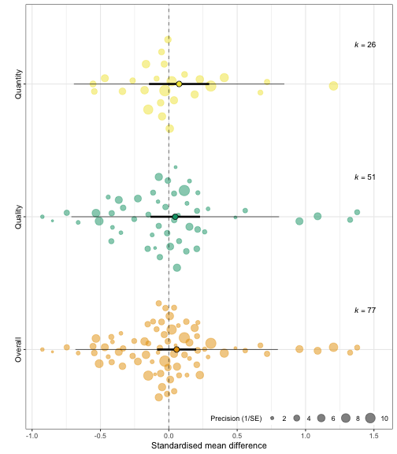
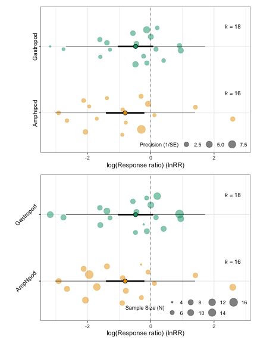
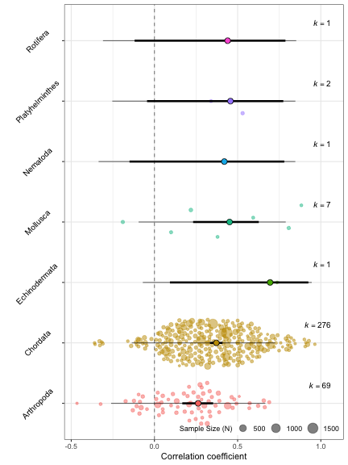

# Introduction

`orchaRd` allows users to create pretty orchard plots that contain both confidence and prediction intervals around mean effect size estimates, plots the effect size distribution over top such estimates and weights effect sizes by their precision (1/sampling error) or sample size. `orchaRd` takes a `metafor` object of class `rma.mv` or `rma` (Viechtbauer, 2010) and plots the results for the meta-analytic or meta-regression model. Currently, only meta-regression models with a single moderator variable are allowed or intercept only meta-analytic models. `orchaRd` uses `ggplot` (Wickham, 2009) for plotting, and as such, layers can be added directly to make plots customizable to the users needs.

# Citing orchaRd

To cite `orchaRd` in publications one can use the following reference:

Nakagawa, S. et al. 2020. The Orchard Plot: Cutlivatinng the Forest Plot 
for Use in Ecology,  Evolution and Beyond. Research Synthesis Methods, in review

# Installation

To install `orchaRd` use the following code in R:


```r
install.packages("devtools")
install.packages("tidyverse")
install.packages("metafor")
install.packages("patchwork")
devtools::install_github("itchyshin/orchard_plot", subdir = "orchaRd", force = TRUE)

library(orchaRd)
library(patchwork)
library(tidyverse)
library(metafor)
```

Installation will make the primary functions accessible to users along with their help files. You will also need the `tidyverse` and `metafor` packages.

# Examples of how it works 

In this vignette we'll walk the reader through a number of case studies and show you how you can create beautiful looking orchard plots. We overview three different case studies that make use of different effect sizes and moderators. The datasets associated with each case study come as part of the `orchaRd` package.

#### Example 1: Dietary Restriction and Lifespan
English and Uller (2016) performed a systematic review and meta-analysis on the effects of early life dietary restriction (a reduction in a major component of the diet without malnutrition; e.g. caloric restriction) on average at death, using the standardised mean difference (often called d). They found that across the whole dataset, there was little evidence for an effect of dietary restriction on mean age at death. Here we'll use the dataset to first calculate the effect size measures and then fit an intercept only, meta-analytic model.


```r

data(english)

# We need to calculate the effect sizes, in this case d
english <- metafor::escalc(measure = "SMD", n1i = NStartControl, sd1i = SD_C, m1i = MeanC, 
    n2i = NStartExpt, sd2i = SD_E, m2i = MeanE, data = english)


english_MR_int <- metafor::rma.mv(yi = yi, V = vi, random = list(~1 | EffectID), 
    data = english)
summary(english_MR_int)
#> 
#> Multivariate Meta-Analysis Model (k = 77; method: REML)
#> 
#>   logLik  Deviance       AIC       BIC      AICc 
#> -46.6874   93.3748   97.3748  102.0362   97.5391   
#> 
#> Variance Components:
#> 
#>             estim    sqrt  nlvls  fixed    factor 
#> sigma^2    0.1271  0.3566     77     no  EffectID 
#> 
#> Test for Heterogeneity:
#> Q(df = 76) = 297.4722, p-val < .0001
#> 
#> Model Results:
#> 
#> estimate      se    zval    pval    ci.lb   ci.ub 
#>   0.0239  0.0510  0.4676  0.6401  -0.0761  0.1238    
#> 
#> ---
#> Signif. codes:  0 '***' 0.001 '**' 0.01 '*' 0.05 '.' 0.1 ' ' 1
```

We can see from the above that we have fit a meta-analytic model without an intercept and thus the mean estimates is the overall effect size on the effects of caloric restriction on mean death across all studies examined. Now that we have fit our meta-analytic model we can get the confidence intervals and prediction intervals with a few functions in the `orchaRd` package. If one is interested in getting the table of results we can use the `mod_results` function. This will allow users to make nice tables of the results if needed. We can do that as follows:


```r

model_results <- orchaRd::mod_results(english_MR_int, mod = "Int")
print(model_results)
#>      name   estimate     lowerCL   upperCL    lowerPR   upperPR
#> 1 Intrcpt 0.02385105 -0.07612047 0.1238226 -0.6821196 0.7298217
```

If we instead want to create an orchard plot and visualise the results we can do so quite simply as:


```r
orchard_plot(english_MR_int, mod = "Int", xlab = "Standardised mean difference", 
    transfm = "none") + 
scale_fill_manual(values = "grey") + 
scale_colour_manual(values = "grey")
#> Scale for 'fill' is already present. Adding another scale for 'fill', which will replace the
#> existing scale.
#> Scale for 'colour' is already present. Adding another scale for 'colour', which will replace the
#> existing scale.
```



In \ref{fig:Figure1} we simply add in the metafor model and it will create a default orchard plot. Alternatively, we could also add in the table of results.


```r
orchard_plot(model_results, mod = "Int", xlab = "Standardised mean difference", transfm = "none") + 
    scale_fill_manual(values = "grey") + 
scale_colour_manual(values = "grey")
#> Scale for 'fill' is already present. Adding another scale for 'fill', which will replace the
#> existing scale.
#> Scale for 'colour' is already present. Adding another scale for 'colour', which will replace the
#> existing scale.
```



Fugure \ref{fig:Figure2} and Figure \ref{fig:Figure1} above show that overall estimate from a random-effects meta-analysis of 77 effect sizes is centered on zero, with a 95% CI that spans the line of no-effect. The prediction intervals clearly demonstrate the high level of heterogeneity, with effects size less than -0.5 and greater than 0.5 predicted to be observed. 

In a subsequent publication, Senior et al. (2017) analysed this dataset for effects of dietary-restriction on among-individual variation in the age at death using the log coefficient of variation ratio. A major prediction in both English & Uller (2016) and Senior et al. (2017) was that the type pf manipulation, whether the study manipulated quality of food versus the quantity of food would be important. As such, we can fit a meta-regression model to test whether the moderator "Manipulation Type" impacts our results on the mean and variance


```r
# First we need to calculate the lnCVR
english$lnCVR <- metafor::escalc(measure = "CVR", n1i = NStartControl, sd1i = SD_C, 
    m1i = MeanC, n2i = NStartExpt, sd2i = SD_E, m2i = MeanE, data = english)


# Now we can fit the meta-regression models
english_MR <- metafor::rma.mv(yi = yi, V = vi, mods = ~ManipType - 1, random = list(~1 | 
    EffectID), data = english)
summary(english_MR)
#> 
#> Multivariate Meta-Analysis Model (k = 77; method: REML)
#> 
#>   logLik  Deviance       AIC       BIC      AICc 
#> -46.5719   93.1437   99.1437  106.0962   99.4818   
#> 
#> Variance Components:
#> 
#>             estim    sqrt  nlvls  fixed    factor 
#> sigma^2    0.1296  0.3600     77     no  EffectID 
#> 
#> Test for Residual Heterogeneity:
#> QE(df = 75) = 295.5324, p-val < .0001
#> 
#> Test of Moderators (coefficients 1:2):
#> QM(df = 2) = 0.2832, p-val = 0.8680
#> 
#> Model Results:
#> 
#>                    estimate      se    zval    pval    ci.lb   ci.ub 
#> ManipTypeQuality     0.0125  0.0666  0.1874  0.8513  -0.1181  0.1431    
#> ManipTypeQuantity    0.0401  0.0805  0.4981  0.6184  -0.1178  0.1980    
#> 
#> ---
#> Signif. codes:  0 '***' 0.001 '**' 0.01 '*' 0.05 '.' 0.1 ' ' 1

# Again, we can create a table of results
model_results <- orchaRd::mod_results(english_MR, mod = "ManipType")
print(model_results)
#>       name   estimate    lowerCL   upperCL    lowerPR   upperPR
#> 1  Quality 0.01248610 -0.1180989 0.1430711 -0.7050164 0.7299886
#> 2 Quantity 0.04011772 -0.1177539 0.1979893 -0.6828489 0.7630844

# Lets fit a meta-regression - I am modelling non-independence here (article).
senior_MR <- metafor::rma.mv(yi = lnCVR, V = vi, mods = ~ManipType - 1, random = list(~1 | 
    EffectID), data = english)
#> Error in metafor::rma.mv(yi = lnCVR, V = vi, mods = ~ManipType - 1, random = list(~1 | : Number of rows of the model matrix does not match length of the outcome vector.
summary(senior_MR)
#> 
#> Multivariate Meta-Analysis Model (k = 77; method: REML)
#> 
#>   logLik  Deviance       AIC       BIC      AICc 
#> -33.6583   67.3166   73.3166   80.2690   73.6546   
#> 
#> Variance Components:
#> 
#>             estim    sqrt  nlvls  fixed    factor 
#> sigma^2    0.0726  0.2695     77     no  EffectID 
#> 
#> Test for Residual Heterogeneity:
#> QE(df = 75) = 215.7242, p-val < .0001
#> 
#> Test of Moderators (coefficients 1:2):
#> QM(df = 2) = 5.6956, p-val = 0.0580
#> 
#> Model Results:
#> 
#>                    estimate      se     zval    pval    ci.lb    ci.ub 
#> ManipTypeQuality    -0.1258  0.0529  -2.3805  0.0173  -0.2294  -0.0222  * 
#> ManipTypeQuantity    0.0106  0.0625   0.1695  0.8654  -0.1118   0.1330    
#> 
#> ---
#> Signif. codes:  0 '***' 0.001 '**' 0.01 '*' 0.05 '.' 0.1 ' ' 1

# creating a table of results
senior_results <- mod_results(senior_MR, "ManipType")
print(senior_results)
#>       name    estimate    lowerCL     upperCL    lowerPR   upperPR
#> 1  Quality -0.12582843 -0.2294275 -0.02222936 -0.6641038 0.4124469
#> 2 Quantity  0.01058903 -0.1118324  0.13301043 -0.5316237 0.5528017


# We can now plot SMD and lnCVR beside each other and compar ethe results
p1 <- orchard_plot(english_MR, mod = "ManipType", xlab = "Standardised mean difference", 
    transfm = "none")

p2 <- orchard_plot(senior_MR, mod = "ManipType", xlab = "log(CV ratio) (lnCVR)", 
    transfm = "none")

p1/p2
```



Our orchard plot for the log coefficient of variation demonstrates that, while restrictions on dietary quality and quantity do not affect the average age at death (top of Figure \ref{fig:Figure3}), among-individual variation may be altered by quality restrictions (bottom of Figure \ref{fig:Figure3}). The effect is negative suggesting that the coefficient of variation in the control group is lower than that in the treatment group, and the 95% CI does not span zero. Again though, the effect is heterogeneous; a substantial number of positive effects are still predicted. 

#### Example 2: Predation and Invertebrate Community 

Eklof et al. (2012) evaluated the effects of predation on benthic invertebrate communities. Using the log response ratio they quantified differences in abundance and/or biomass of gastropods and Amphipods in groups with and without predation in an experimental setting. 

Here again, we can create orchard plots of the model results, but we'll show how a few simple things can be modified. Again, we can fit the meta-analytic model first: 


```r

data(eklof)

# Calculate the effect size
eklof <- escalc(measure = "ROM", n1i = N_control, sd1i = SD_control, m1i = mean_control, 
    n2i = N_treatment, sd2i = SD_treatment, m2i = mean_treatment, data = eklof)

# Add the unit level predictor
eklof$Datapoint <- as.factor(seq(1, dim(eklof)[1], 1))

# Also, we can get the sample size, which we can use for weighting if we would
# like
eklof$N <- rowSums(eklof[, c("N_control", "N_treatment")])

# fit a MLMR - accouting for some non-independence
eklof_MR <- rma.mv(yi = yi, V = vi, mods = ~Grazer.type - 1, random = list(~1 | ExptID, 
    ~1 | Datapoint), data = eklof)
```

Above we have fit a meta-regression model using "Grazer Type" as a moderator which is predicted to explain variation in log response ratios. We can demonstrate a few simple changes users can make, but we note here that users can make far more complex changes down the line if needed, but we'll save those for the last example. The first is the angle at which the y-axis labels are positioned (bottom of Figure \ref{fig:Figure4}):


```r

p3 <- orchard_plot(eklof_MR, mod = "Grazer.type", xlab = "log(Response ratio) (lnRR)", 
    transfm = "none")

p4 <- orchard_plot(eklof_MR, mod = "Grazer.type", xlab = "log(Response ratio) (lnRR)", 
    transfm = "none", angle = 45)

p3/p4
```



The other thing we can change is the type of scaling we wish to use. Lets say we are interested in scaling the effect size by the total sample size of the study we use a vector of N, sample size (bottom of Figure \ref{fig:Figure5}):


```r

p5 <- orchard_plot(eklof_MR, mod = "Grazer.type", xlab = "log(Response ratio) (lnRR)", 
    transfm = "none")

p6 <- orchard_plot(eklof_MR, mod = "Grazer.type", xlab = "log(Response ratio) (lnRR)", 
    transfm = "none", angle = 45, N = eklof$N)
#> Warning in if (N != "none") {: the condition has length > 1 and only the first element will be used

p5/p6
```


Overall, our orchard plot shows the results of a re-analysis of their data. The effects are negative for both Gastropods and Amphipods suggesting that mean abundance/biomass in the control group is lower than in the treatment groups, although the effect is largest, and is statistically significant, for Amphipods. In both cases the prediction intervals reveal the extent of heterogeneity, with positive effects predicted to be observed.

#### Example 3: Maternal-Offspring Morphological Correlations

Finally, we also look at the case discussed by Lim et al. (2014), who meta-analysed the strength of correlation between maternal and offspring size within-species, across a very wide range of taxa. The found, that typically, there is a moderate positive correlation between maternal size and offspring size within species (i.e. larger mothers have larger offspring). However, they also found evidence for relatively strong phylogenetic effects suggesting the strength of the association is dependent on evolutionary lineage.

Here we have used an orchard plot to represent the results obtained when meta-analysing the data from Lim et al. (2014) by taxonomic Phylum. 


```r
data(lim)

# Add in the sampling variance
lim$vi <- (1/sqrt(lim$N - 3))^2

# Lets fit a meta-regression - I will do Article non-independence. The
# phylogenetic model found phylogenetic effects, however, instead we could fit
# Phylum as a fixed effect and explore them with an Orchard Plot
lim_MR <- metafor::rma.mv(yi = yi, V = vi, mods = ~Phylum - 1, random = list(~1 | 
    Article, ~1 | Datapoint), data = lim)
summary(lim_MR)
#> 
#> Multivariate Meta-Analysis Model (k = 357; method: REML)
#> 
#>   logLik  Deviance       AIC       BIC      AICc 
#> -97.6524  195.3049  213.3049  248.0263  213.8343   
#> 
#> Variance Components:
#> 
#>             estim    sqrt  nlvls  fixed     factor 
#> sigma^2.1  0.0411  0.2029    220     no    Article 
#> sigma^2.2  0.0309  0.1757    357     no  Datapoint 
#> 
#> Test for Residual Heterogeneity:
#> QE(df = 350) = 1912.9637, p-val < .0001
#> 
#> Test of Moderators (coefficients 1:7):
#> QM(df = 7) = 356.6775, p-val < .0001
#> 
#> Model Results:
#> 
#>                        estimate      se     zval    pval    ci.lb   ci.ub 
#> PhylumArthropoda         0.2690  0.0509   5.2829  <.0001   0.1692  0.3687  *** 
#> PhylumChordata           0.3908  0.0224  17.4190  <.0001   0.3468  0.4347  *** 
#> PhylumEchinodermata      0.8582  0.3902   2.1992  0.0279   0.0934  1.6230    * 
#> PhylumMollusca           0.4867  0.1275   3.8175  0.0001   0.2368  0.7366  *** 
#> PhylumNematoda           0.4477  0.3054   1.4658  0.1427  -0.1509  1.0463      
#> PhylumPlatyhelminthes    0.4935  0.2745   1.7980  0.0722  -0.0444  1.0314    . 
#> PhylumRotifera           0.4722  0.3021   1.5634  0.1180  -0.1198  1.0642      
#> 
#> ---
#> Signif. codes:  0 '***' 0.001 '**' 0.01 '*' 0.05 '.' 0.1 ' ' 1
```

Noe we can plot a default orchard plot, scaling each effect size by N. Also, because we are using Zr, we can use transfm = "tanh" and it will do the conversions for us:


```r
orchard_plot(lim_MR, mod = "Phylum", xlab = "Correlation coefficient", alpha = 0.5, 
    transfm = "tanh", angle = 45, N = lim$N, cb = FALSE)
#> Warning in if (N != "none") {: the condition has length > 1 and only the first element will be used
```



Now that we have Figure \ref{fig:Figure6} we can do some small changes to make it pretty. Currently, the cb argument is "FALSE", we can change this to "TRUE" to use colour blind friendly colours. Additionally, because we are using `ggplot` we can add element to the figure to make it look pretty. 


```r
	orchard_plot(lim_MR, mod = "Phylum", xlab = "Correlation coefficient (r)", alpha = 0.5, transfm = "tanh", angle = 45, N = lim$N, cb = TRUE) +

    theme(legend.position= c(0.05, 0.99), 
        
        legend.justification = c(0,1), 
        
        legend.key.size = unit(1, "mm")) +

  	theme(legend.direction="horizontal", 
      
      legend.title = element_text(size =8),
      
      legend.text = element_text(size = 10)) + 

  	scale_x_continuous(expand = c(0.1,0.1))
#> Warning in if (N != "none") {: the condition has length > 1 and only the first element will be used
```



As in Figure \ref{fig:Figure7}, New elements can be added to the `orchard_plot` to modify it as one sees fit. It will overwrite existing elements. From our orchard plots above, it is clear that the analysis is dominated by data from Chordates and Arthropods, with the other Phyla being much more poorly represented. Second, there is a difference between the strength of a typical correlation within these two well represented groups (the correlation is stronger in Chordates), which arguably would explain the phylogenetic signals detected by Lim et al. (2014). Lastly, although there are differences within the typical correlation between Chordates and Arthropods, there remains a large overlap in predicted range of individual effect sizes; individual species within Phyla are still highly variable.

\newpage
# References 

Eklof J.S., Alsterberg C., Havenhand J.N., Sundback K., Wood H.L., Gamfeldt L. 2012. Experimental climate change weakens the insurance effect of biodiversity. Ecology Letters, 15:864-872.

English S, Uller T. 2016. Does early-life diet affect longevity? A meta-analysis across experimental studies. Biology Letters, 12: http://doi:10.1098/rsbl.2016.0291

Lim J.N., Senior A.M., Nakagawa S. 2014. Heterogeneity in individual quality and reproductive trade-offs within species. Evolution. 68(8):2306-18. doi: 10.1111/evo.12446

Senior, A.M., Nakagawa, S., Simpson, S.J., Raubenheimer, D., Noble D.W.A. 2017. Dietary restriction increases variability in longevity. Biology Letters, 13: http://doi.org/10.1098/rsbl.2017.0057

Viechtbauer W. 2010. Conducting meta-analyses in R with the metafor package. Journal of Statistical Software, 36(3):1-48.

Wickham H. 2009. ggplot2 : elegant graphics for data analysis. New York ; London: Springer.


