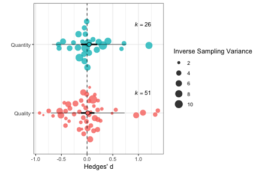
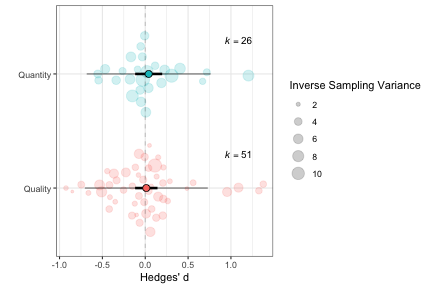
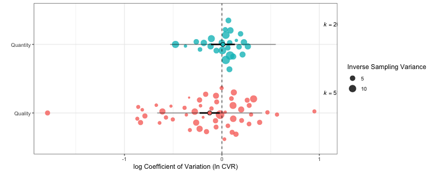
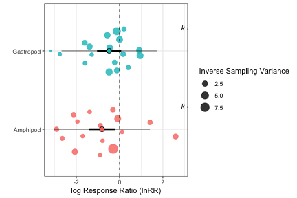
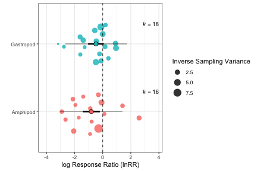
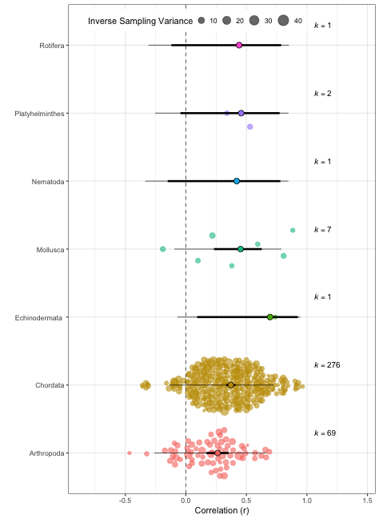

# Introduction

`orchaRd` allows users to create pretty orchard plots that contain both confidence and prediction intervals around mean effect size estimates, plots the effect size distribution over top such estimates and weights effect sizes by their precision (1/sampling variance) or sample size. `orchaRd` takes a `metafor` object of class `rma.mv` or `rma` and plots the results for the meta-analytic or meta-regression model. Currently, only meta-regression models with a single moderator variable are allowed. `orchaRd` uses `ggplot` for plotting, and as such, layers can be added directly to make plots customizable to the users needs.

# Citing orchaRd

To cite `orchaRd` in publications one can use the following reference:

Nakagawa, S. et al. 2020. The Orchard Plot: Domesticating the Forest Plot 
for Use in Ecology and Evolution. Research Synthesis Methods, in press.

# Installation

To install `orchaRd` use the following code in R:


```r
install.packages("devtools")
install.packages("tidyverse")
install.packages("metafor")
devtools::install_github("itchyshin/orchard_plot", subdir = "orchaRd", force = TRUE)

library(orchaRd)
library(tidyverse)
library(metafor)
```

Installation will make the primary functions accessible to users along with their help files. You will also need the `tidyverse` and `metafor` packages.

# Examples of how it works 

In this vignette we'll walk you through a number of case studies and show you how you can create beautiful looking orchard plots. We overview three different case studies that make use of different effect sizes and moderators. The datasets associated with each case study come as part of the orchaRd package.

#### Example 1: Dietary Restriction and Lifespan
English and Uller (2016) performed a systematic review and meta-analysis on the effects of early life dietary restriction (a reduction in a major component of the diet without malnutrition; e.g. caloric restriction) on average at death, using the standardised mean difference (often called d). They found that across the whole dataset, there was little evidence for an effect of dietary restriction on mean age at death.


```r

data(english)

# We need to calculate the effect sizes, in this case d
english <- metafor::escalc(measure = "SMD", n1i = NStartControl, sd1i = SD_C, m1i = MeanC, 
    n2i = NStartExpt, sd2i = SD_E, m2i = MeanE, data = english)

english_MR <- metafor::rma.mv(yi = yi, V = vi, mods = ~ManipType - 1, random = list(~1 | 
    EffectID), data = english)
summary(english_MR)
#> 
#> Multivariate Meta-Analysis Model (k = 77; method: REML)
#> 
#>   logLik  Deviance       AIC       BIC      AICc 
#> -46.5719   93.1437   99.1437  106.0962   99.4818   
#> 
#> Variance Components:
#> 
#>             estim    sqrt  nlvls  fixed    factor 
#> sigma^2    0.1296  0.3600     77     no  EffectID 
#> 
#> Test for Residual Heterogeneity:
#> QE(df = 75) = 295.5324, p-val < .0001
#> 
#> Test of Moderators (coefficients 1:2):
#> QM(df = 2) = 0.2832, p-val = 0.8680
#> 
#> Model Results:
#> 
#>                    estimate      se    zval    pval    ci.lb   ci.ub 
#> ManipTypeQuality     0.0125  0.0666  0.1874  0.8513  -0.1181  0.1431    
#> ManipTypeQuantity    0.0401  0.0805  0.4981  0.6184  -0.1178  0.1980    
#> 
#> ---
#> Signif. codes:  0 '***' 0.001 '**' 0.01 '*' 0.05 '.' 0.1 ' ' 1
```

We can see from the above that we have fit a model without an intercept here and thus the mean estimates in each of the levels of the moderator "Manipulation Type" are estimated. Now that we have fit out meta-regression model we can get the confidence intervals and prediction intervals with a few function in the `orchaRd` package as follows


```r
model_results <- orchaRd::mod_results(english_MR, mod = "ManipType")
print(model_results)
#>       name   estimate    lowerCL   upperCL    lowerPR   upperPR
#> 1  Quality 0.01248610 -0.1180989 0.1430711 -0.7050164 0.7299886
#> 2 Quantity 0.04011772 -0.1177539 0.1979893 -0.6828489 0.7630844
```

Here we have the meta-analytic mean for each manipulation type level. If we want to create an orchard plot we can do so quite simply as:


```r
orchaRd::orchard_plot(english_MR, mod = "ManipType", es_type = "Hedges' d")
```



Above, we simply add in the metafor model and it will create a default orchard plot. Alternatively, we could also add in the table of results and modify alpha to make the data a little less pronounced:


```r
orchaRd::orchard_plot(model_results, mod = "ManipType", es_type = "Hedges' d", alpha = 0.2)
```



Our orchard plot above shows that overall estimate from a random-effects meta-analysis of 77 effect sizes is centered on zero, with a 95% CI that spans the line of no-effect. The prediction intervals clearly demonstrate the high level of heterogeneity, with effects size less than -0.5 and greater than 0.5 predicted to be observed. 

In a subsequent publication, Senior et al. (2017) analysed this dataset for effects of dietary-restriction on among-individual variation in the age at death using the log coefficient of variation ratio. 


```r
english <- metafor::escalc(measure = "CVR", n1i = NStartControl, sd1i = SD_C, m1i = MeanC, 
    n2i = NStartExpt, sd2i = SD_E, m2i = MeanE, data = english)

# Lets fit a meta-regression - I am modelling non-independence here (article).
senior_MR <- metafor::rma.mv(yi = yi, V = vi, mods = ~ManipType - 1, random = list(~1 | 
    EffectID), data = english)
summary(senior_MR)
#> 
#> Multivariate Meta-Analysis Model (k = 77; method: REML)
#> 
#>   logLik  Deviance       AIC       BIC      AICc 
#> -33.6583   67.3166   73.3166   80.2690   73.6546   
#> 
#> Variance Components:
#> 
#>             estim    sqrt  nlvls  fixed    factor 
#> sigma^2    0.0726  0.2695     77     no  EffectID 
#> 
#> Test for Residual Heterogeneity:
#> QE(df = 75) = 215.7242, p-val < .0001
#> 
#> Test of Moderators (coefficients 1:2):
#> QM(df = 2) = 5.6956, p-val = 0.0580
#> 
#> Model Results:
#> 
#>                    estimate      se     zval    pval    ci.lb    ci.ub 
#> ManipTypeQuality    -0.1258  0.0529  -2.3805  0.0173  -0.2294  -0.0222  * 
#> ManipTypeQuantity    0.0106  0.0625   0.1695  0.8654  -0.1118   0.1330    
#> 
#> ---
#> Signif. codes:  0 '***' 0.001 '**' 0.01 '*' 0.05 '.' 0.1 ' ' 1

# creating a table of results
senior_results <- mod_results(senior_MR, "ManipType")
print(senior_results)
#>       name    estimate    lowerCL     upperCL    lowerPR   upperPR
#> 1  Quality -0.12582843 -0.2294275 -0.02222936 -0.6641038 0.4124469
#> 2 Quantity  0.01058903 -0.1118324  0.13301043 -0.5316237 0.5528017

orchard_plot(senior_MR, mod = "ManipType", es_type = "log Coefficient of Variation (ln CVR)", 
    alpha = 0.8)
```



Our orchard plot for the log coefficient of variation demonstrates that, while restrictions on dietary quality and quantity do not affect the average age at death, among-individual variation may be altered by quality restrictions. The effect is negative suggesting that the coefficient of variation in the control group is lower than that in the treatment group, and the 95% CI does not span zero. Again though, the effect is heterogeneous; a substantial number of positive effects are still predicted. 

#### Example 2: Predation and Invertebrate Community 

Eklof et al. 2012 evaluated the effects of predation on benthic invertebrate communities. Using the log response ratio they quantified differences in abundance and/or biomass of gastropods and Amphipods in groups with and without predation in an experimental setting. 

Here again, we can create orchard plots of the model results:


```r

data(eklof)

# Calculate the effect size
eklof <- escalc(measure = "ROM", n1i = N_control, sd1i = SD_control, m1i = mean_control, 
    n2i = N_treatment, sd2i = SD_treatment, m2i = mean_treatment, data = eklof)

# Add the unit level predictor
eklof$Datapoint <- as.factor(seq(1, dim(eklof)[1], 1))

# Also, we can get the sample size, which we can use for weighting if we would
# like
eklof$N <- rowSums(eklof[, c("N_control", "N_treatment")])

# fit a MLMR - accouting for some non-independence
eklof_MR <- rma.mv(yi = yi, V = vi, mods = ~Grazer.type - 1, random = list(~1 | ExptID, 
    ~1 | Datapoint), data = eklof)

orchard_plot(eklof_MR, mod = "Grazer.type", es_type = "log Response Ratio (lnRR)")
```


Our orchard plot shows the results of a re-analysis of their data. The effects are negative for both Gastropods and Amphipods suggesting that mean abundance/biomass in the control group is lower than in the treatment groups, although the effect is largest, and is statistically significant, for Amphipods. In both cases the prediction intervals reveal the extent of heterogeneity, with positive effects predicted to be observed.

But, the figure is cut off a bit. A useful thing about `orchard` is that it takes advantage of element wise addition so users can adjust the look of their figures quite easily. So, we can modify the axes if we would like:

```r
orchard_plot(eklof_MR, mod = "Grazer.type", es_type = "log Response Ratio (lnRR)") + 
    scale_x_continuous(expand = c(0.2, 0.2))
```




#### Example 3: Maternal-Offspring Morphological Correlations

Finally, we also look at the case discussed by Lim et al. (2014), who meta-analysed the strength of correlation between maternal and offspring size within-species, across a very wide range of taxa. The found, that typically, there is a moderate positive correlation between maternal size and offspring size within species (i.e. larger mothers have larger offspring). However, they also found evidence for relatively strong phylogenetic effects suggesting the strength of the association is dependent on evolutionary lineage.

Here we have used an orchard plot to represent the results obtained when meta-analysing the data from Lim et al. (2014) by taxonomic Phylum. 


```r
data(lim)

# Add in the sampling variance
lim$vi <- (1/sqrt(lim$N - 3))^2

# Lets fit a meta-regression - I will do Article non-independence. The
# phylogenetic model found phylogenetic effects, however, instead we could fit
# Phylum as a fixed effect and explore them with an Orchard Plot
lim_MR <- metafor::rma.mv(yi = yi, V = vi, mods = ~Phylum - 1, random = list(~1 | 
    Article, ~1 | Datapoint), data = lim)
summary(lim_MR)
#> 
#> Multivariate Meta-Analysis Model (k = 357; method: REML)
#> 
#>   logLik  Deviance       AIC       BIC      AICc 
#> -97.6524  195.3049  213.3049  248.0263  213.8343   
#> 
#> Variance Components:
#> 
#>             estim    sqrt  nlvls  fixed     factor 
#> sigma^2.1  0.0411  0.2029    220     no    Article 
#> sigma^2.2  0.0309  0.1757    357     no  Datapoint 
#> 
#> Test for Residual Heterogeneity:
#> QE(df = 350) = 1912.9637, p-val < .0001
#> 
#> Test of Moderators (coefficients 1:7):
#> QM(df = 7) = 356.6775, p-val < .0001
#> 
#> Model Results:
#> 
#>                        estimate      se     zval    pval    ci.lb   ci.ub 
#> PhylumArthropoda         0.2690  0.0509   5.2829  <.0001   0.1692  0.3687  *** 
#> PhylumChordata           0.3908  0.0224  17.4190  <.0001   0.3468  0.4347  *** 
#> PhylumEchinodermata      0.8582  0.3902   2.1992  0.0279   0.0934  1.6230    * 
#> PhylumMollusca           0.4867  0.1275   3.8175  0.0001   0.2368  0.7366  *** 
#> PhylumNematoda           0.4477  0.3054   1.4658  0.1427  -0.1509  1.0463      
#> PhylumPlatyhelminthes    0.4935  0.2745   1.7980  0.0722  -0.0444  1.0314    . 
#> PhylumRotifera           0.4722  0.3021   1.5634  0.1180  -0.1198  1.0642      
#> 
#> ---
#> Signif. codes:  0 '***' 0.001 '**' 0.01 '*' 0.05 '.' 0.1 ' ' 1
```

Now that we have the model fit we can plot our orchard and do some small changes to make it pretty. Also, because we are using Zr, we can use "Zr" and it will do the conversions for us:


```r
orchard_plot(lim_MR, mod = "Phylum", es_type = "Zr", alpha = 0.6) + guides(fill = "none", 
    colour = "none") + theme(legend.position = c(0.05, 0.99), legend.justification = c(0, 
    1), legend.key.size = unit(1, "mm")) + theme(legend.direction = "horizontal") + 
    scale_x_continuous(expand = c(0.2, 0.2))
```



First, it is clear that the analysis is dominated by data from Chordates and Arthropods, with the other Phyla being much more poorly represented. Second, there is a difference between the strength of a typical correlation within these two well represented groups (the correlation is stronger in Chordates), which arguably would explain the phylogenetic signals detected by Lim et al. (2014). Lastly, although there are differences within the typical correlation between Chordates and Arthropods, there remains a large overlap in predicted range of individual effect sizes; individual species within Phyla are still highly variable.


# References 

English S, Uller T. 2016. Does early-life diet affect longevity? A meta-analysis across experimental studies. Biology Letters, 12: http://doi:10.1098/rsbl.2016.0291

Senior, A.M., Nakagawa, S., Simpson, S.J., Raubenheimer, D., Noble D.W.A. 2017. Dietary restriction increases variability in longevity. Biology Letters, 13: http://doi.org/10.1098/rsbl.2017.0057

Lim J.N., Senior A.M., Nakagawa S. 2014. Heterogeneity in individual quality and reproductive trade-offs within species. Evolution. 68(8):2306-18. doi: 10.1111/evo.12446


