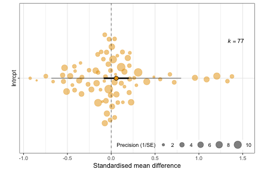
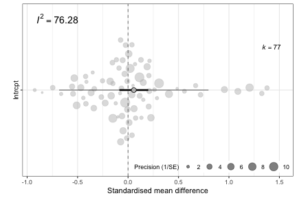
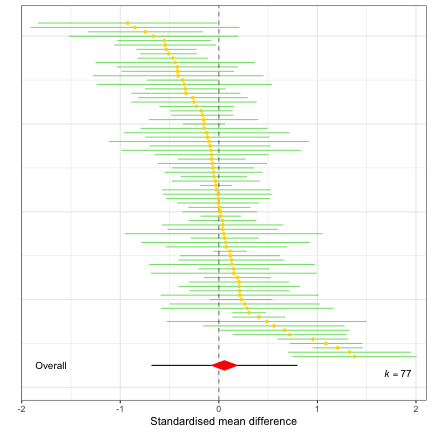
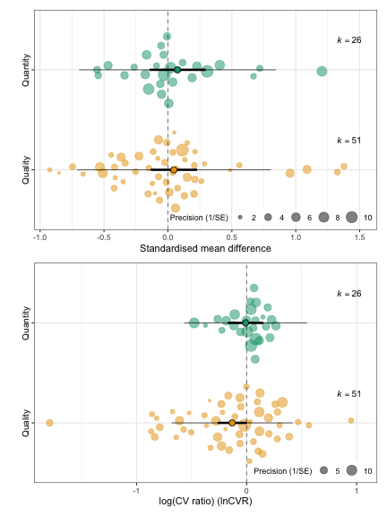
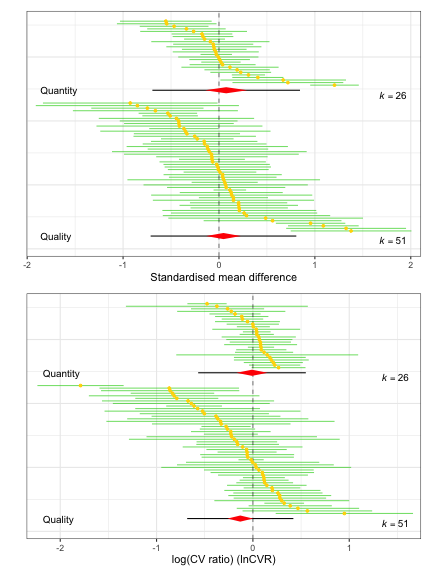
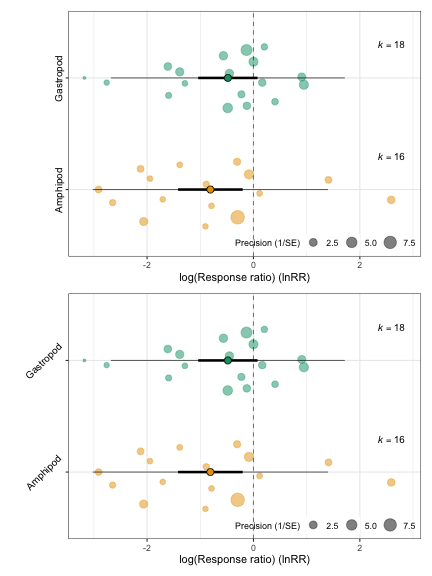

# Introduction

`orchaRd` allows users to create pretty orchard plots that contain both confidence intervals (CIs) and prediction intervals (PIs) around point estimates for different categorical moderators, plots the effect size distribution over top such estimates and weights effect sizes by their precision (1/standard error, SE) or sample size. `orchaRd` takes a `metafor` object of class `rma.mv` or `rma` (Viechtbauer, 2010) and plots the results for the meta-analytic or meta-regression model. Currently, only meta-regression models with a single moderator variable are allowed or intercept only meta-analytic models. `orchaRd` uses `ggplot2` (Wickham, 2009) for plotting, and as such, layers can be added directly to make plots customisable to the users needs. Also, the function `orchard_plot` uses the principles of bee swarm plots to visualise individual effect sizes (Elund 2012; also see Clarke & Sherrill-Mix 2012; Sherrill-Mix & Clarke 2012).

In addition to orchard plots, users can use the `caterpillars` function to draw caterpillar(s) plots. Furthermore, the package `orchaRd` comes with two functions that are useful for multilevel meta-analysis and meta-regression (i.e., `rma.mv`): 1) `i2_ml` to calculate the 'total' I^2^ along with I^2^ for each level (*sensu* Nakagawa & Santos 2012; see also ; Senior et al. 2016) and 2) `r2_ml` to calculate marginal and conditional R^2^ for mixed models (*sensu* Nakagawa & Schielzeth 2013). 

# Citing orchaRd

To cite `orchaRd` in publications one can use the following reference:

Nakagawa, S. et al. 2020. The Orchard Plot: Cutlivatinng the Forest Plot for Use in Ecology, Evolution and Beyond. *Research Synthesis Methods*, (revision) (*EcoEvoRxiv*: https://ecoevorxiv.org/epqa7/)

# Installation

To install `orchaRd` use the following code in R:


```r
install.packages("devtools")
install.packages("tidyverse")
install.packages("metafor")
install.packages("patchwork")
install.packages("R.rsp")
devtools::install_github("itchyshin/orchard_plot", subdir = "orchaRd", force = TRUE, 
    build_vignettes = TRUE)
```

Installation will make the primary functions accessible to users along with their help files. You will also need the `tidyverse` and `metafor` packages.


# Examples of orchard plots along with caterpillars plot

In this vignette we'll walk the reader through a number of case studies and show you how you can create beautiful looking orchard plots. We overview three different case studies that make use of different effect sizes and moderators. The datasets associated with each case study come as part of the `orchaRd` package.

#### Example 1: Dietary Restriction and Lifespan

English and Uller (2016) performed a systematic review and meta-analysis on the effects of early life dietary restriction (a reduction in a major component of the diet without malnutrition; e.g. caloric restriction) on average age at death, using the standardised mean difference (often called *d*). They found that, across the whole dataset, there was little evidence for an effect of dietary restriction on mean age at death. Here we'll use the dataset to first calculate the effect size measures and then fit an intercept only, meta-analytic model.


```r

data(english)

# We need to calculate the effect sizes, in this case d
english <- escalc(measure = "SMD", n1i = NStartControl, sd1i = SD_C, m1i = MeanC, 
    n2i = NStartExpt, sd2i = SD_E, m2i = MeanE, var.names = c("SMD", "vSMD"), data = english)

english_MA <- rma.mv(yi = SMD, V = vSMD, random = list(~1 | StudyNo, ~1 | EffectID), 
    data = english)
summary(english_MA)
#> 
#> Multivariate Meta-Analysis Model (k = 77; method: REML)
#> 
#>   logLik  Deviance       AIC       BIC      AICc 
#> -44.5943   89.1887   95.1887  102.1809   95.5220   
#> 
#> Variance Components:
#> 
#>             estim    sqrt  nlvls  fixed    factor 
#> sigma^2.1  0.0614  0.2478     21     no   StudyNo 
#> sigma^2.2  0.0760  0.2756     77     no  EffectID 
#> 
#> Test for Heterogeneity:
#> Q(df = 76) = 297.4722, p-val < .0001
#> 
#> Model Results:
#> 
#> estimate      se    zval    pval    ci.lb   ci.ub 
#>   0.0572  0.0729  0.7845  0.4327  -0.0856  0.2000    
#> 
#> ---
#> Signif. codes:  0 '***' 0.001 '**' 0.01 '*' 0.05 '.' 0.1 ' ' 1
```

We have fit a meta-analytic model and thus the only estimate we see is the overall effect size on the effects of caloric restriction on mean death across all studies examined. Now that we have fit our meta-analytic model we can get the confidence intervals and prediction intervals with a few functions in the `orchaRd` package. If one is interested in getting the table of results we can use the `mod_results` function. This will allow users to make nice tables of the results if needed. We can do that as follows:


```r

model_results <- orchaRd::mod_results(english_MA, mod = "Int")
print(model_results)
#>      name   estimate     lowerCL  upperCL   lowerPR   upperPR
#> 1 Intrcpt 0.05715615 -0.08563968 0.199952 -0.683237 0.7975493
```

If we instead want to create an orchard plot and visualise the results we can do so quite simply as:


```r
orchard_plot(english_MA, mod = "Int", xlab = "Standardised mean difference", transfm = "none")
```



In Figure \ref{fig:Figure1}, we simply add in the metafor model and it will create a default orchard plot. Alternatively, we could also add in the table of results. Also. some people may wish to present the heterogeneity index, I^2^ and, at the same time, change the colours of the 'trunk and furit' by adding a few arguments.


```r

# use i2_sn function to obtain the total I^2

I2 <- i2_ml(english_MA)

orchard_plot(model_results, mod = "Int", xlab = "Standardised mean difference") + 
    annotate(geom = "text", x = -0.7, y = 1.5, label = paste0("italic(I)^{2} == ", 
        round(I2[1], 4) * 100), color = "black", parse = TRUE, size = 5) + scale_fill_manual(values = "grey") + 
    scale_colour_manual(values = "grey")
#> Scale for 'fill' is already present. Adding another scale for 'fill', which will replace the
#> existing scale.
#> Scale for 'colour' is already present. Adding another scale for 'colour', which will replace the
#> existing scale.
```



Figure \ref{fig:Figure2} and Figure \ref{fig:Figure1} above show that overall estimate from a random-effects meta-analysis of 77 effect sizes is centered on zero, with a 95% CI that spans the line of no-effect. The prediction intervals clearly demonstrate the high level of heterogeneity (over 75%), with effects size less than -0.5 and greater than 0.5 predicted to be observed. 

We can now draw a comparable caterpillar plot by using the function `caterpillars`.


```r

# a caterpillar plot (not a caterpillars plot)
caterpillars(model_results, mod = "Int", xlab = "Standardised mean difference")
```


It is now interesting to compare how the same data set can be visualised different by look at Figure \ref{fig:Figure2} and Figure \ref{fig:Figure3}. It is good that the caterpillar plot can show CIs for each effect size. An equivalent function was done with the size of fruit in the orchard plot. 

In a subsequent publication, Senior et al. (2017) analysed this dataset for effects of dietary-restriction on among-individual variation in the age at death using the log coefficient of variation ratio. A major prediction in both English & Uller (2016) and Senior et al. (2017) was that the type of manipulation, whether the study manipulated quality of food versus the quantity of food would be important. As such, we can fit a meta-regression model to test whether the moderator "Manipulation Type" `ManipType` impacts our results on the mean and variance


```r
# First we need to calculate the lnCVR
english <- escalc(measure = "CVR", n1i = NStartControl, sd1i = SD_C, m1i = MeanC, 
    n2i = NStartExpt, sd2i = SD_E, m2i = MeanE, var.names = c("lnCVR", "vlnCVR"), 
    data = english)

# Now we can fit the meta-regression model (contrast)
english_MR0 <- rma.mv(yi = SMD, V = vSMD, mods = ~ManipType, random = list(~1 | StudyNo, 
    ~1 | EffectID), data = english)
summary(english_MR0)
#> 
#> Multivariate Meta-Analysis Model (k = 77; method: REML)
#> 
#>   logLik  Deviance       AIC       BIC      AICc 
#> -44.2108   88.4216   96.4216  105.6916   96.9931   
#> 
#> Variance Components:
#> 
#>             estim    sqrt  nlvls  fixed    factor 
#> sigma^2.1  0.0655  0.2560     21     no   StudyNo 
#> sigma^2.2  0.0761  0.2758     77     no  EffectID 
#> 
#> Test for Residual Heterogeneity:
#> QE(df = 75) = 295.5324, p-val < .0001
#> 
#> Test of Moderators (coefficient 2):
#> QM(df = 1) = 0.0414, p-val = 0.8388
#> 
#> Model Results:
#> 
#>                    estimate      se    zval    pval    ci.lb   ci.ub 
#> intrcpt              0.0469  0.0924  0.5079  0.6115  -0.1342  0.2281    
#> ManipTypeQuantity    0.0283  0.1390  0.2035  0.8388  -0.2442  0.3008    
#> 
#> ---
#> Signif. codes:  0 '***' 0.001 '**' 0.01 '*' 0.05 '.' 0.1 ' ' 1

# Now we can fit the meta-regression model without the intercept we need this
# intercept-less model for the orchard plot
english_MR <- rma.mv(yi = SMD, V = vSMD, mods = ~ManipType - 1, random = list(~1 | 
    StudyNo, ~1 | EffectID), data = english)
summary(english_MR)
#> 
#> Multivariate Meta-Analysis Model (k = 77; method: REML)
#> 
#>   logLik  Deviance       AIC       BIC      AICc 
#> -44.2108   88.4216   96.4216  105.6916   96.9931   
#> 
#> Variance Components:
#> 
#>             estim    sqrt  nlvls  fixed    factor 
#> sigma^2.1  0.0655  0.2560     21     no   StudyNo 
#> sigma^2.2  0.0761  0.2758     77     no  EffectID 
#> 
#> Test for Residual Heterogeneity:
#> QE(df = 75) = 295.5324, p-val < .0001
#> 
#> Test of Moderators (coefficients 1:2):
#> QM(df = 2) = 0.6532, p-val = 0.7214
#> 
#> Model Results:
#> 
#>                    estimate      se    zval    pval    ci.lb   ci.ub 
#> ManipTypeQuality     0.0469  0.0924  0.5079  0.6115  -0.1342  0.2281    
#> ManipTypeQuantity    0.0752  0.1122  0.6704  0.5026  -0.1447  0.2951    
#> 
#> ---
#> Signif. codes:  0 '***' 0.001 '**' 0.01 '*' 0.05 '.' 0.1 ' ' 1

# Again, we can create a table of results
res2 <- mod_results(english_MR, mod = "ManipType")
print(res2)
#>       name   estimate    lowerCL   upperCL    lowerPR   upperPR
#> 1  Quality 0.04693124 -0.1341875 0.2280500 -0.7125254 0.8063879
#> 2 Quantity 0.07521998 -0.1446838 0.2951238 -0.6944086 0.8448485

# we fit a meta-regression (contrast) for the log coefficient of variation
senior_MR0 <- rma.mv(yi = lnCVR, V = vlnCVR, mods = ~ManipType, random = list(~1 | 
    StudyNo, ~1 | EffectID), data = english)
summary(senior_MR0)
#> 
#> Multivariate Meta-Analysis Model (k = 77; method: REML)
#> 
#>   logLik  Deviance       AIC       BIC      AICc 
#> -32.0740   64.1481   72.1481   81.4180   72.7195   
#> 
#> Variance Components:
#> 
#>             estim    sqrt  nlvls  fixed    factor 
#> sigma^2.1  0.0275  0.1657     21     no   StudyNo 
#> sigma^2.2  0.0470  0.2169     77     no  EffectID 
#> 
#> Test for Residual Heterogeneity:
#> QE(df = 75) = 215.7242, p-val < .0001
#> 
#> Test of Moderators (coefficient 2):
#> QM(df = 1) = 1.3308, p-val = 0.2487
#> 
#> Model Results:
#> 
#>                    estimate      se     zval    pval    ci.lb   ci.ub 
#> intrcpt             -0.1310  0.0678  -1.9333  0.0532  -0.2639  0.0018  . 
#> ManipTypeQuantity    0.1217  0.1055   1.1536  0.2487  -0.0851  0.3285    
#> 
#> ---
#> Signif. codes:  0 '***' 0.001 '**' 0.01 '*' 0.05 '.' 0.1 ' ' 1

# Let's fit a meta-regression without the intercept
senior_MR <- rma.mv(yi = lnCVR, V = vlnCVR, mods = ~ManipType - 1, random = list(~1 | 
    StudyNo, ~1 | EffectID), data = english)
summary(senior_MR)
#> 
#> Multivariate Meta-Analysis Model (k = 77; method: REML)
#> 
#>   logLik  Deviance       AIC       BIC      AICc 
#> -32.0740   64.1481   72.1481   81.4180   72.7195   
#> 
#> Variance Components:
#> 
#>             estim    sqrt  nlvls  fixed    factor 
#> sigma^2.1  0.0275  0.1657     21     no   StudyNo 
#> sigma^2.2  0.0470  0.2169     77     no  EffectID 
#> 
#> Test for Residual Heterogeneity:
#> QE(df = 75) = 215.7242, p-val < .0001
#> 
#> Test of Moderators (coefficients 1:2):
#> QM(df = 2) = 3.7419, p-val = 0.1540
#> 
#> Model Results:
#> 
#>                    estimate      se     zval    pval    ci.lb   ci.ub 
#> ManipTypeQuality    -0.1310  0.0678  -1.9333  0.0532  -0.2639  0.0018  . 
#> ManipTypeQuantity   -0.0093  0.0825  -0.1131  0.9099  -0.1711  0.1524    
#> 
#> ---
#> Signif. codes:  0 '***' 0.001 '**' 0.01 '*' 0.05 '.' 0.1 ' ' 1

# creating a table of results
res3 <- mod_results(senior_MR, "ManipType")
print(res3)
#>       name     estimate    lowerCL     upperCL    lowerPR   upperPR
#> 1  Quality -0.131037178 -0.2638834 0.001809059 -0.6821678 0.4200934
#> 2 Quantity -0.009336131 -0.1710708 0.152398490 -0.5681339 0.5494616


# We can now plot SMD and lnCVR beside each other and compare the results
p1 <- orchard_plot(english_MR, mod = "ManipType", xlab = "Standardised mean difference")

p2 <- orchard_plot(senior_MR, mod = "ManipType", xlab = "log(CV ratio) (lnCVR)")

p1/p2
```



Our orchard plot for the log coefficient of variation demonstrates that, while restrictions on dietary quality and quantity do not affect the average age at death (top of Figure \ref{fig:Figure4}), among-individual variation may be altered by quality restrictions (bottom of Figure \ref{fig:Figure4}). The effect is negative suggesting that the coefficient of variation in the control group is lower than that in the treatment group, and the 95% CI does not span zero. Again though, the effect is heterogeneous; a substantial number of positive effects are still predicted. 

Let's draw comparable caterpillars plots to compare these two results again. 


```r

# We can now plot SMD and lnCVR beside each other and compare the results
p1c <- caterpillars(english_MR, mod = "ManipType", xlab = "Standardised mean difference")

p2c <- caterpillars(senior_MR, mod = "ManipType", xlab = "log(CV ratio) (lnCVR)")

p1c/p2c
```


Now compare between Figure \ref{fig:Figure4} and Figure \ref{fig:Figure5}. We think they both look nice. 

#### Example 2: Predation and Invertebrate Community 

Eklof et al. (2012) evaluated the effects of predation on benthic invertebrate communities. Using the log response ratio they quantified differences in abundance and/or biomass of gastropods and Amphipods in groups with and without predation in an experimental setting. 

Here again, we can create orchard plots of the model results, but we'll show how a few simple things can be modified. Again, we can fit the meta-analytic model first: 


```r

data(eklof)

# Calculate the effect size
eklof <- escalc(measure = "ROM", n1i = N_control, sd1i = SD_control, m1i = mean_control, 
    n2i = N_treatment, sd2i = SD_treatment, m2i = mean_treatment, var.names = c("lnRR", 
        "vlnRR"), data = eklof)

# Add the observation level factor
eklof$Datapoint <- as.factor(seq(1, dim(eklof)[1], 1))

# Also, we can get the sample size, which we can use for weighting if we would
# like
eklof$N <- rowSums(eklof[, c("N_control", "N_treatment")])

# fit a meta-regression with the intercept (contrast)
eklof_MR0 <- rma.mv(yi = lnRR, V = vlnRR, mods = ~Grazer.type, random = list(~1 | 
    ExptID, ~1 | Datapoint), data = eklof)

summary(eklof_MR0)
#> 
#> Multivariate Meta-Analysis Model (k = 34; method: REML)
#> 
#>   logLik  Deviance       AIC       BIC      AICc 
#> -51.9349  103.8698  111.8698  117.7328  113.3513   
#> 
#> Variance Components:
#> 
#>             estim    sqrt  nlvls  fixed     factor 
#> sigma^2.1  0.5075  0.7124     18     no     ExptID 
#> sigma^2.2  0.6703  0.8187     34     no  Datapoint 
#> 
#> Test for Residual Heterogeneity:
#> QE(df = 32) = 195.9943, p-val < .0001
#> 
#> Test of Moderators (coefficient 2):
#> QM(df = 1) = 0.8891, p-val = 0.3457
#> 
#> Model Results:
#> 
#>                       estimate      se     zval    pval    ci.lb    ci.ub 
#> intrcpt                -0.8095  0.3099  -2.6119  0.0090  -1.4170  -0.2021  ** 
#> Grazer.typegastropod    0.3285  0.3484   0.9429  0.3457  -0.3544   1.0114     
#> 
#> ---
#> Signif. codes:  0 '***' 0.001 '**' 0.01 '*' 0.05 '.' 0.1 ' ' 1

# fit a meta-regression without the intercept and we can use this model for the
# orchard plot
eklof_MR <- rma.mv(yi = lnRR, V = vlnRR, mods = ~Grazer.type - 1, random = list(~1 | 
    ExptID, ~1 | Datapoint), data = eklof)
```

Above we have fit a meta-regression model using "Grazer Type" as a moderator which is predicted to explain variation in log response ratios. We can demonstrate a few simple changes users can make, but we note here that users can make far more complex changes down the line if needed, but we'll save explaining these more complex changes for the last example. The first is the angle at which the y-axis labels are positioned (bottom of Figure \ref{fig:Figure6}):


```r

p3 <- orchard_plot(eklof_MR, mod = "Grazer.type", xlab = "log(Response ratio) (lnRR)", 
    transfm = "none")

p4 <- orchard_plot(eklof_MR, mod = "Grazer.type", xlab = "log(Response ratio) (lnRR)", 
    transfm = "none", angle = 45)

p3/p4
```



The other thing we can change is the type of scaling we wish to use. Let's say we are interested in scaling the effect size by the total sample size of the study we use a vector of N, sample size (bottom of Figure \ref{fig:Figure7}):


```r

p5 <- orchard_plot(eklof_MR, mod = "Grazer.type", xlab = "log(Response ratio) (lnRR)")

p6 <- orchard_plot(eklof_MR, mod = "Grazer.type", xlab = "log(Response ratio) (lnRR)", 
    angle = 45, N = eklof$N)

p5/p6
```


Overall, our orchard plot shows the results of a re-analysis of their data. The estimated mean effects are negative for both gastropods and amphipods suggesting that mean abundance/biomass in the control group is lower than in the treatment groups, although the effect is largest, and is statistically significant, for amphipods. In both cases the prediction intervals reveal the extent of heterogeneity, with positive effects predicted to be observed.

Again, we can also draw the caterpillars-plot counterpart for this dataset (bottom of Figure \ref{fig:Figure8}):


```r

caterpillars(eklof_MR, mod = "Grazer.type", xlab = "log(Response ratio) (lnRR)")
```


Like last time, we compare between Figure \ref{fig:Figure7} and Figure \ref{fig:Figure8}. Again, they both look quite informative. 

#### Example 3: Maternal-Offspring Morphological Correlations

Finally, we also look at the case discussed by Lim et al. (2014), who meta-analysed the strength of correlation between maternal and offspring size within-species, across a very wide range of taxa. They found, that typically, there is a moderate positive correlation between maternal size and offspring size within species (i.e. larger mothers have larger offspring). However, they also found evidence for relatively strong phylogenetic effects suggesting that the strength of the association is dependent on evolutionary lineage.

Here we have used an orchard plot to represent the results obtained when meta-analysing the data from Lim et al. (2014) by taxonomic Phylum. 


```r
data(lim)

# Add in the sampling variance
lim$vi <- (1/sqrt(lim$N - 3))^2

# Lets fit a meta-regression - I will do Article non-independence. The
# phylogenetic model found phylogenetic effects, however, instead we could fit
# Phylum as a fixed effect and explore them with an Orchard Plot
lim_MR <- metafor::rma.mv(yi = yi, V = vi, mods = ~Phylum - 1, random = list(~1 | 
    Article, ~1 | Datapoint), data = lim)
summary(lim_MR)
#> 
#> Multivariate Meta-Analysis Model (k = 357; method: REML)
#> 
#>   logLik  Deviance       AIC       BIC      AICc 
#> -97.6524  195.3049  213.3049  248.0263  213.8343   
#> 
#> Variance Components:
#> 
#>             estim    sqrt  nlvls  fixed     factor 
#> sigma^2.1  0.0411  0.2029    220     no    Article 
#> sigma^2.2  0.0309  0.1757    357     no  Datapoint 
#> 
#> Test for Residual Heterogeneity:
#> QE(df = 350) = 1912.9637, p-val < .0001
#> 
#> Test of Moderators (coefficients 1:7):
#> QM(df = 7) = 356.6775, p-val < .0001
#> 
#> Model Results:
#> 
#>                        estimate      se     zval    pval    ci.lb   ci.ub 
#> PhylumArthropoda         0.2690  0.0509   5.2829  <.0001   0.1692  0.3687  *** 
#> PhylumChordata           0.3908  0.0224  17.4190  <.0001   0.3468  0.4347  *** 
#> PhylumEchinodermata      0.8582  0.3902   2.1992  0.0279   0.0934  1.6230    * 
#> PhylumMollusca           0.4867  0.1275   3.8175  0.0001   0.2368  0.7366  *** 
#> PhylumNematoda           0.4477  0.3054   1.4658  0.1427  -0.1509  1.0463      
#> PhylumPlatyhelminthes    0.4935  0.2745   1.7980  0.0722  -0.0444  1.0314    . 
#> PhylumRotifera           0.4722  0.3021   1.5634  0.1180  -0.1198  1.0642      
#> 
#> ---
#> Signif. codes:  0 '***' 0.001 '**' 0.01 '*' 0.05 '.' 0.1 ' ' 1
```

Noe we can plot a default orchard plot, scaling each effect size by N. Also, because we are using Zr, we can use transfm = "tanh" and it will do the conversions for us:


```r
# Plot the meta-regression model
orchard_plot(lim_MR, mod = "Phylum", xlab = "Correlation coefficient", alpha = 0.5, 
    transfm = "tanh", angle = 45, N = lim$N, cb = FALSE)
```


Now that we have Figure \ref{fig:Figure9}, we can do some small changes to make it pretty and add some more details, such as between study heterogeneity and R2 for phylum (we use ). Currently, the cb argument is "FALSE", we can change this to "TRUE" to use colour blind friendly colours. Additionally, because we are using `ggplot` we can add element to the figure to make it look pretty. 


```r
  # Lets add the R2 on the figure as well as little modifications:
  R2 <- r2_ml(lim_MR)

  # We can draw an orchard plot with R2
  orchard_plot(lim_MR, mod = "Phylum", xlab = "Correlation coefficient (r)", alpha = 0.5, transfm = "tanh", angle = 45, N = lim$N, cb = TRUE) +

    theme(legend.position= c(0.05, 0.99), 
        
        legend.justification = c(0,1), 
        
        legend.key.size = unit(1, "mm")) +

  	theme(legend.direction="horizontal", 
      
      legend.title = element_text(size =8),
      
      legend.text = element_text(size = 10)) + 

  	scale_x_continuous(expand = c(0.1,0.1)) +

    annotate(geom="text", x=-0.5, y=0.7, label=paste0("italic(R)^{2} == ", round(R2[1]*100, 2)),color="black", parse = TRUE, size = 4) +

        annotate(geom="text", x=-0.31, y=0.67, label="%",color="black", parse = FALSE, size = 4)
```


As in Figure \ref{fig:Figure10}, new elements can be added to the `orchard_plot` to modify it as one sees fit. It will overwrite existing elements. From our orchard plots above, it is clear that the analysis is dominated by data from Chordates and Arthropods, with the other Phyla being much more poorly represented. Second, there is a difference between the strength of a typical correlation within these two well represented groups (the correlation is stronger in Chordates), which arguably would explain the phylogenetic signals detected by Lim et al. (2014). Lastly, although there are differences within the typical correlation between Chordates and Arthropods, there remains a large overlap in predicted range of individual effect sizes; individual species within Phyla are still highly variable.

Finally, we make a comparable caterpillars plot.

```r
# Plot the meta-regression model
caterpillars(lim_MR, mod = "Phylum", xlab = "Correlation coefficient", transfm = "tanh")
```


Compared to the orchard plot (Figure \ref{fig:Figure10}), Figure \ref{fig:Figure11} does not look as elegant, unlike the previous comparisons. This is because the groups with small sample sizes are packed at the top of the figure. 

\newpage
# References 

Clarke E, Sherrill-Mix S. ggbeeswarm: categorical scatter (violin point) plots. 2017. *R package* version 0.6.0 

Eklof J.S., Alsterberg C., Havenhand J.N., Sundback K., Wood H.L., Gamfeldt L. 2012. Experimental climate change weakens the insurance effect of biodiversity. *Ecology Letters*, 15:864-872.

Eklund A. Beeswarm: the bee swarm plot, an alternative to stripchart. 2012. *R package* version 0.1. 

English S, Uller T. 2016. Does early-life diet affect longevity? A meta-analysis across experimental studies. *Biology Letters*, 12: http://doi:10.1098/rsbl.2016.0291

Lim J.N., Senior A.M., Nakagawa S. 2014. Heterogeneity in individual quality and reproductive trade-offs within species. *Evolution*. 68(8):2306-18. doi: 10.1111/evo.12446

Nakagawa, S, and Santos, E.S.A. 2012. Methodological issues and advances in biological meta-analysis. *Evolutionary Ecology* 26(5): 1253-1274.

Nakagawa, S, and Schielzeth, H. 2013. A general and simple method for obtaining R2 from generalized linear mixed‐effects models. *Methods in Ecology and Evolution* 4(2): 133-142.

Sherrill-Mix S, Clarke E. Plot categorical data using quasirandom noise and density estimates. 2017. *R package* version 0.4.5. 

Senior, A. M., Grueber, C. E., Kamiya, T., Lagisz, M., O’Dwyer, K., Santos, E. S. A. & Nakagawa S. 2016. Heterogeneity in ecological and evolutionary meta-analyses: its magnitudes and implications. *Ecology* 97(12): 3293-3299.

Senior, A.M., Nakagawa, S., Simpson, S.J., Raubenheimer, D., Noble D.W.A. 2017. Dietary restriction increases variability in longevity. *Biology Letters*, 13: http://doi.org/10.1098/rsbl.2017.0057

Viechtbauer W. 2010. Conducting meta-analyses in R with the metafor package. *Journal of Statistical Software*, 36(3):1-48.

Wickham H. 2009. ggplot2: elegant graphics for data analysis. New York ; London: Springer.

